# PHD Studio V3 — Deploy Pipeline Audit

**Data:** 30/06/2026  
**Contexto:** Falha no Release Gate 01 após `git commit --amend` + `git push --force-with-lease`  
**Erro reportado:** `fatal: Need to specify how to reconcile divergent branches.`  
**Etapa afetada:** `Ensure Git is up to date before deploy` (GitHub Actions)

---

## 1. Arquivos encontrados

### 1.1 GitHub Actions (prioridade)

| Arquivo | Função |
|---------|--------|
| `.github/workflows/deploy.yml` | **Pipeline principal de produção** — SSH no servidor + sync Git + `deploy-remote.sh` |
| `.github/workflows/block-vercel.yml` | Guard rail — bloqueia deploy acidental no Vercel (não faz deploy) |

Não existem `deploy.yaml` nem `deploy-*.yml` adicionais além dos acima.

### 1.2 Scripts Docker (chamados pela pipeline)

| Arquivo | Função | Chamado por |
|---------|--------|-------------|
| `deploy/docker/scripts/deploy-remote.sh` | **Script de deploy de produção** — Git sync + Docker build/up | `deploy.yml` (linha 173) |
| `deploy/docker/scripts/deploy-traefik.sh` | Deploy alternativo com validação obrigatória de Traefik | Manual / legado — **não** chamado pelo workflow |
| `deploy/docker/scripts/deploy-easypanel.sh` | Deploy simplificado Easypanel | Manual |
| `deploy/docker/scripts/deploy-local.sh` | Ambiente local Docker | Desenvolvimento |
| `deploy/docker/scripts/deploy-local.ps1` | Ambiente local Docker (Windows) | Desenvolvimento |

### 1.3 Infraestrutura Docker

| Arquivo | Função |
|---------|--------|
| `deploy/docker/config/docker-compose.yml` | Stack produção — `phdstudio-app` + `phd-api` + labels Traefik |
| `deploy/docker/config/docker-compose.local.yml` | Stack local |
| `deploy/docker/config/Dockerfile` | Build frontend (Node → Nginx) |
| `deploy/docker/config/api.Dockerfile` | Build API Node |
| `deploy/docker/config/nginx.conf` | Config Nginx do container frontend |
| `deploy/docker/config/nginx-init.conf` | Init Nginx |
| `deploy/config/shared/.env.example` | Template de variáveis de ambiente |

### 1.4 Deploy alternativo (não usado pelo workflow)

| Arquivo | Função |
|---------|--------|
| `deploy/linux/deploy.sh` | Deploy Ubuntu sem Docker Actions |
| `deploy/linux/setup-database.sh` | Setup PostgreSQL Linux |
| `deploy/windows/deploy.ps1` | Deploy Windows nativo |
| `deploy/windows/setup-database.ps1` | Setup DB Windows |

### 1.5 Scripts auxiliares

| Arquivo | Função |
|---------|--------|
| `scripts/block-vercel.sh` | Chamado por `deploy-remote.sh` — valida ausência de Vercel |
| `scripts/check-deploy-ready.sh` | Pré-validação de prontidão |
| `scripts/check-deploy.sh` | Status do deploy |
| `scripts/check-502.sh` | Diagnóstico 502 |

### 1.6 Documentação relacionada

| Arquivo | Função |
|---------|--------|
| `docs/deployment/docker.md` | Guia Docker |
| `docs/CORRECAO_DEPLOY_GITHUB_ACTIONS.md` | Correção anterior de sync (2024/2025) |
| `docs/troubleshooting-deploy-ssh.md` | Troubleshooting SSH |
| `docs/BLOQUEIO_VERCEL.md` | Política anti-Vercel |

### 1.7 Servidor (referenciado no workflow, não versionado)

| Caminho | Função |
|---------|--------|
| `/root/phdstudio` | Clone Git no servidor de produção |
| `deploy/config/shared/.env` | Variáveis de ambiente (no servidor) |

---

## 2. Fluxo atual

### 2.1 Diagrama da pipeline de produção

```mermaid
flowchart TD
    A[git push origin main] --> B[GitHub Actions: deploy.yml]
    B --> C[Checkout code no runner]
    C --> D[Setup SSH Agent]
    D --> E[Test server connectivity]
    E --> F[Test SSH connection]
    F --> G["Ensure Git is up to date before deploy<br/>SSH → /root/phdstudio"]
    G --> G1[git fetch origin main]
    G1 --> G2[git checkout main se necessário]
    G2 --> G3["git pull origin main ⚠️ FALHA AQUI"]
    G3 --> H["Deploy to server<br/>SSH → /root/phdstudio"]
    H --> H1[git fetch origin main]
    H1 --> H2{LOCAL == REMOTE?}
    H2 -->|Não| H3["git pull origin main ⚠️"]
    H2 -->|Sim| H4[deploy-remote.sh]
    H3 --> H4
    H4 --> I[git_pull dentro do script]
    I --> I1[git fetch]
    I1 --> I2["git pull com lógica merge-base<br/>--no-rebase em divergência"]
    I2 --> J[block-vercel.sh]
    J --> K[check docker / env / traefik]
    K --> L[stop_existing container]
    L --> M[docker compose build]
    M --> N[docker compose up -d]
    N --> O[check_status docker ps]
    O --> P[docker image prune]
    P --> Q[Traefik roteia phdstudio.com.br]
    Q --> R[Notify deployment]
```



### 2.2 Fluxo passo a passo (confirmado no código)

| # | Etapa | Onde | O que faz |
|---|-------|------|-----------|
| 1 | **Trigger** | `deploy.yml:4-9` | Push em `main`/`master` ou `workflow_dispatch` |
| 2 | **Checkout** | `deploy.yml:20-21` | Checkout no runner GitHub (não usado no deploy remoto) |
| 3 | **SSH setup** | `deploy.yml:23-26` | Carrega `SSH_PRIVATE_KEY` via `webfactory/ssh-agent` |
| 4 | **Connectivity test** | `deploy.yml:28-66` | Ping + teste TCP porta SSH (`continue-on-error`) |
| 5 | **SSH test** | `deploy.yml:68-86` | `ssh root@SERVER_HOST 'echo OK'` |
| 6 | **Git sync (pré-deploy)** | `deploy.yml:88-127` | SSH → `cd /root/phdstudio` → `fetch` → `checkout` → **`pull`** |
| 7 | **Git sync (re-check)** | `deploy.yml:158-169` | Compara `LOCAL` vs `REMOTE`; **`pull`** se diferente |
| 8 | **Deploy script** | `deploy.yml:171-173` | `./deploy/docker/scripts/deploy-remote.sh` |
| 9 | **Git sync (script)** | `deploy-remote.sh:119-189` | Função `git_pull()` com fetch + merge-base + pull |
| 10 | **Block Vercel** | `deploy-remote.sh:240-247` | `scripts/block-vercel.sh` |
| 11 | **Docker checks** | `deploy-remote.sh:53-117` | Docker, `.env`, Traefik |
| 12 | **Stop container** | `deploy-remote.sh:191-201` | `docker stop/rm phdstudio-app` |
| 13 | **Build** | `deploy-remote.sh:203-210` | `docker compose -f deploy/docker/config/docker-compose.yml build` |
| 14 | **Up** | `deploy-remote.sh:212-219` | `docker compose up -d` |
| 15 | **Status** | `deploy-remote.sh:221-232` | Verifica se `phdstudio-app` está running (`docker ps`) |
| 16 | **Cleanup** | `deploy-remote.sh:234-238` | `docker image prune -f` |
| 17 | **Proxy** | `docker-compose.yml:34-48` | Traefik roteia `phdstudio.com.br` → container porta 80 |
| 18 | **API health** | `docker-compose.yml:104-109` | Healthcheck apenas em `phd-api` (não no frontend) |
| 19 | **Notify** | `deploy.yml:176-189` | Log sucesso/falha no Actions |

**Nota:** Não há health check HTTP explícito da Landing no workflow. A validação é `docker ps` no container frontend.

---

## 3. Problema identificado

### 3.1 Localização exata

| Campo | Valor |
|-------|-------|
| **Arquivo** | `.github/workflows/deploy.yml` |
| **Etapa** | `Ensure Git is up to date before deploy` |
| **Linha** | **123** |
| **Comando** | `git pull origin "$TARGET_BRANCH" \|\| exit 1` |
| **Função** | Bloco SSH inline (não é função nomeada) |

### 3.2 Pontos adicionais com o mesmo risco

| Arquivo | Linha | Comando | Etapa |
|---------|-------|---------|-------|
| `.github/workflows/deploy.yml` | 166 | `git pull origin "$TARGET_BRANCH"` | `Deploy to server (Docker / Traefik)` |
| `deploy/docker/scripts/deploy-remote.sh` | 161 | `git pull origin "$GIT_BRANCH"` | `git_pull()` — caso local atrás |
| `deploy/docker/scripts/deploy-remote.sh` | 166 | `git pull origin "$GIT_BRANCH" --no-rebase` | `git_pull()` — local à frente |
| `deploy/docker/scripts/deploy-remote.sh` | 171 | `git pull origin "$GIT_BRANCH" --no-rebase` | `git_pull()` — divergência |

**O erro reportado ocorre na linha 123**, porque essa etapa executa **antes** de `deploy-remote.sh` e usa `git pull` **sem nenhuma flag** de reconciliação.

### 3.3 Mensagem de erro

```
fatal: Need to specify how to reconcile divergent branches.
```

Introduzida no **Git 2.27+** quando:
- `git pull` é executado em modo não-interativo;
- branches local e remoto **divergiram** (não é fast-forward);
- não há configuração global/local de `pull.rebase`, `pull.ff`, ou flag explícita (`--rebase`, `--no-rebase`, `--ff-only`).

---

## 4. Risco — Por que falhou após `commit --amend` + `force-with-lease`

### 4.1 Sequência causal

```
Estado inicial:
  origin/main  →  commit A (ex: f0a5172)
  servidor     →  commit A  (deploy anterior sincronizou)

Após amend + force push:
  origin/main  →  commit B (ex: f0a5172' — hash diferente, histórico reescrito)
  servidor     →  commit A  (ainda aponta para o commit antigo)

Após git fetch no servidor:
  origin/main  →  B
  HEAD local   →  A

Resultado:
  LOCAL ≠ REMOTE
  merge-base(A, B) pode não existir ou branches são divergentes
  git pull sem estratégia → Git aborta com erro fatal
```

### 4.2 Por que `git pull` é inadequado aqui

| Cenário | `git pull` (merge) | Comportamento desejado |
|---------|-------------------|------------------------|
| Fast-forward normal | ✅ Funciona | ✅ OK |
| `commit --amend` + force push | ❌ Divergência / histórico reescrito | Servidor deve **descartar** A e adotar B |
| Rebase + force push | ❌ Mesmo problema | Servidor deve espelhar `origin/main` |
| Rollback (revert no remoto) | ⚠️ Pode criar merge commit | Servidor deve espelhar `origin/main` |
| Tag push | ✅ Não afeta branch sync | N/A |
| Mudanças locais no servidor | ⚠️ `deploy-remote.sh` faz stash; workflow não | Deve descartar mudanças locais |

O servidor é **dedicado ao projeto** e o remoto é **fonte de verdade**. Não há cenário legítimo em que o servidor deva preservar commits locais ou fazer merge de divergências.

---

## 5. Auditoria — Suporte a operações Git

| Operação | Suportada hoje? | Motivo |
|----------|-----------------|--------|
| `git push` normal (fast-forward) | ✅ Sim | `pull` funciona quando local está atrás |
| `git commit --amend` + `force-with-lease` | ❌ **Não** | Histórico reescrito → divergência → `pull` sem estratégia falha (linha 123) |
| `git rebase` + force push | ❌ **Não** | Mesmo mecanismo |
| Rollback (`git revert` ou reset no remoto) | ⚠️ Parcial | Pode funcionar se fast-forward; falha se divergir |
| Tags | ✅ Não interfere | Workflow não sincroniza tags; deploy usa branch |
| Force update (`push --force`) | ❌ **Não** | Idêntico ao amend |

### 5.1 Inconsistência interna

O workflow (`deploy.yml`) usa `git pull` simples, enquanto `deploy-remote.sh` implementou lógica mais elaborada com `merge-base` e `--no-rebase`. Porém:

1. O workflow **falha antes** de chegar ao script;
2. Mesmo `deploy-remote.sh` usa `git pull` com merge em divergência — **incorreto** para servidor espelho; deveria fazer `reset --hard`;
3. Há **tripla sincronização** redundante (workflow pré-deploy + workflow re-check + `git_pull()` no script).

### 5.2 Riscos adicionais de produção

| Risco | Severidade | Detalhe |
|-------|------------|---------|
| Merge commits no servidor | Alto | `git pull --no-rebase` em divergência cria commits de merge locais no servidor |
| Deploy com código errado | Alto | Se pull falhar, deploy não executa (site pode ficar na versão anterior ou fora do ar se container foi parado em deploy anterior) |
| Mudanças locais no servidor | Médio | Workflow não faz stash; apenas `deploy-remote.sh` |
| Sem health check HTTP | Médio | `check_status` só verifica `docker ps`, não HTTP 200 |
| Triplo git sync | Baixo | Latência e pontos de falha duplicados |

---

## 6. Solução recomendada (proposta — não implementada)

### 6.1 Princípio

> O servidor de produção deve ser um **espelho imutável** de `origin/main`.  
> Sincronização = `fetch` + `reset --hard` + limpeza de working tree.  
> Nunca `git pull` com merge.

### 6.2 Função proposta: `sync_to_remote()`

Substituir todos os `git pull` por uma função única (centralizada em `deploy-remote.sh` e chamada pelo workflow):

```bash
sync_to_remote() {
  local BRANCH="${1:-main}"

  git fetch origin "$BRANCH" || return 1

  # Garantir branch correto
  git checkout "$BRANCH" 2>/dev/null || git checkout -B "$BRANCH" "origin/$BRANCH"

  # Descartar qualquer estado local — remoto é fonte de verdade
  git reset --hard "origin/$BRANCH"

  # Remover artefatos não rastreados que possam interferir no build
  git clean -fd

  # Validação final
  LOCAL=$(git rev-parse HEAD)
  REMOTE=$(git rev-parse "origin/$BRANCH")
  [ "$LOCAL" = "$REMOTE" ] || return 1
}
```

### 6.3 Alterações recomendadas por arquivo

#### A) `.github/workflows/deploy.yml`

| Ação | Detalhe |
|------|---------|
| **Remover** | Etapa `Ensure Git is up to date before deploy` (linhas 88-127) — redundante e frágil |
| **Simplificar** | Etapa `Deploy to server` — remover `git fetch`/`git pull` inline (linhas 158-169) |
| **Manter** | Apenas SSH + execução de `deploy-remote.sh` |
| **Opcional** | Passar commit SHA do push como variável para validação pós-sync |

#### B) `deploy/docker/scripts/deploy-remote.sh`

| Ação | Detalhe |
|------|---------|
| **Substituir** | Função `git_pull()` (linhas 119-189) por `sync_to_remote()` com `reset --hard` |
| **Remover** | Lógica `merge-base` e `git pull --no-rebase` |
| **Manter** | `git fetch` + validação `LOCAL == REMOTE` |

#### C) Configuração Git no servidor (opcional, defesa em profundidade)

```bash
git config pull.ff only        # ou pull.rebase false com reset hard antes
git config receive.denyCurrentBranch updateInstead  # não aplicável em clone
```

Preferível: não depender de config — o script deve ser explícito.

### 6.4 Comportamento após correção

| Operação | Resultado |
|----------|-----------|
| Push normal | `fetch` + `reset --hard` → servidor = remoto ✅ |
| Amend + force push | Servidor descarta commit antigo, adota novo ✅ |
| Rebase + force push | Idêntico ✅ |
| Rollback no remoto | Servidor espelha rollback ✅ |
| Tags | Sem impacto no deploy por branch ✅ |
| Mudanças locais no servidor | `reset --hard` + `clean -fd` descartam ✅ |

### 6.5 Melhorias complementares (fase 2, opcional)

1. **Health check HTTP** pós-deploy: `curl -sf https://phdstudio.com.br/` antes de marcar sucesso
2. **Deploy atômico**: só parar container antigo após build da nova imagem bem-sucedido
3. **Unificar scripts**: `deploy-traefik.sh` e `deploy-remote.sh` convergirem em um entrypoint
4. **Documentar** política: servidor nunca recebe commits locais; todo deploy parte de `origin/main`

---

## 7. Resumo executivo

| Item | Conclusão |
|------|-----------|
| **Pipeline principal** | `.github/workflows/deploy.yml` → SSH → `deploy-remote.sh` → Docker Compose → Traefik |
| **Causa raiz** | `git pull` sem estratégia na linha 123 do `deploy.yml` após histórico reescrito por amend |
| **Por que não chegou ao script** | Workflow falha na etapa pré-deploy antes de executar `deploy-remote.sh` |
| **Adequação para produção** | **Insuficiente** para force push, amend, rebase |
| **Correção definitiva** | `git fetch` + `git reset --hard origin/main` + `git clean -fd` — centralizado em um único ponto |
| **Implementação** | Aguardando aprovação — **nenhum arquivo foi alterado nesta auditoria** |

---

## 8. Próximo passo sugerido

1. Revisar e aprovar esta proposta
2. Implementar `sync_to_remote()` em `deploy-remote.sh`
3. Simplificar `deploy.yml` removendo sync Git duplicado
4. Testar cenários: push normal, amend+force, rollback
5. Re-executar Release Gate deploy com commit de correção
