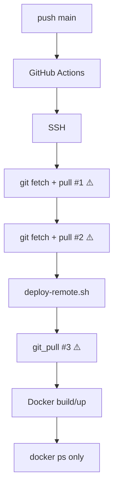
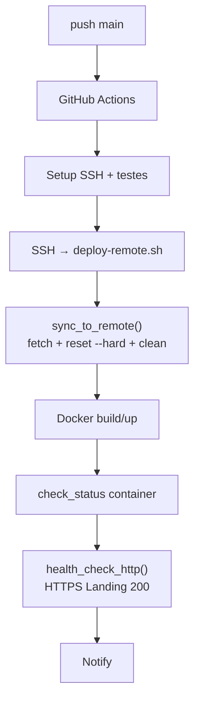

# PHD Studio V3 — Deploy Pipeline Refactoring

## Phase A Report

**Data:** 30/06/2026  
**Referência:** `docs/design/PHD_DEPLOY_PIPELINE_AUDIT.md`  
**Objetivo:** Sincronização Git determinística + simplificação do workflow + health check HTTP

---

## Arquivos modificados

| Arquivo | Tipo de alteração |
|---------|-------------------|
| `.github/workflows/deploy.yml` | Simplificação — remoção de sync Git redundante |
| `deploy/docker/scripts/deploy-remote.sh` | `sync_to_remote()`, `health_check_http()`, remoção de `git_pull()` |
| `docs/design/PHD_DEPLOY_PIPELINE_PHASE_A_REPORT.md` | Este relatório |

**Nenhum outro arquivo foi alterado** (Dockerfiles, Traefik, compose, app React, DDS, CES — intocados).

---

## Mudanças realizadas

### 1. `.github/workflows/deploy.yml`

| Antes | Depois |
|-------|--------|
| Step `Checkout code` (runner não usado no deploy remoto) | Removido |
| Step `Ensure Git is up to date before deploy` com `git fetch` + `git pull` | **Removido** |
| Step `Deploy to server` com segunda rodada de `fetch`/`pull` + script | Apenas SSH → `deploy-remote.sh` |
| Timeout deploy 10 min | 12 min (health check HTTP) |

O workflow agora executa exclusivamente:

1. Setup SSH
2. Test connectivity (opcional, `continue-on-error`)
3. Test SSH connection
4. SSH → `cd /root/phdstudio` → `./deploy/docker/scripts/deploy-remote.sh`
5. Notify deployment

### 2. `deploy/docker/scripts/deploy-remote.sh`

#### `sync_to_remote()` (substitui `git_pull()`)

| Etapa | Comando | Propósito |
|-------|---------|-----------|
| 1 | `git fetch origin` | Atualizar referências remotas |
| 2 | Resolver `main` ou `master` | Branch alvo automático |
| 3 | `git checkout` / `git checkout -B` | Branch local correto |
| 4 | `git reset --hard origin/<branch>` | Espelhar remoto — **sem merge** |
| 5 | `git clean -fd` | Remover artefatos locais |
| 6 | Validar `HEAD == origin/<branch>` | Falha explícita se divergir |

**Não utiliza `git pull`.**

#### `health_check_http()` (nova)

| Parâmetro | Default | Descrição |
|-----------|---------|-----------|
| `HEALTH_CHECK_URL` | `https://phdstudio.com.br/` | URL da Landing |
| `HEALTH_CHECK_RETRIES` | `12` | Tentativas |
| `HEALTH_CHECK_INTERVAL` | `5` | Segundos entre tentativas |

Validação:

- HTTP status `200`
- Corpo contém `phd` (case-insensitive)
- Executada **após** `docker compose up` e `check_status`

#### `main()` — ordem final

```
check_directory → block_vercel → check_docker → check_env → check_traefik
→ sync_to_remote → stop_existing → build_image → deploy
→ check_status → health_check_http → cleanup_images
```

---

## Fluxo antigo



**3 pontos de sincronização Git**, todos com `git pull` vulnerável a histórico reescrito.

---

## Fluxo novo



**1 único ponto de sincronização Git**, determinístico.

---

## Benefícios

| Benefício | Detalhe |
|-----------|---------|
| **Redução de pontos de falha** | De 3 syncs Git para 1; workflow não falha antes do script |
| **Eliminação de duplicidade** | Toda lógica Git centralizada em `sync_to_remote()` |
| **Suporte a histórico reescrito** | `reset --hard` após amend/rebase/force push — sem merge divergente |
| **Servidor como espelho** | `origin/main` é fonte de verdade; mudanças locais descartadas |
| **Deploy verificável** | Health check HTTP confirma Landing, não apenas container running |
| **Manutenção** | Alterações futuras de sync em um único arquivo |

---

## Compatibilidade Git

| Operação | Suportada | Mecanismo |
|----------|-----------|-----------|
| Push normal (fast-forward) | ✅ | `fetch` + `reset --hard` |
| `commit --amend` + `force-with-lease` | ✅ | Descarta commit antigo no servidor |
| Rebase + force push | ✅ | Idêntico ao amend |
| Rollback (reset no remoto) | ✅ | Servidor espelha novo HEAD |
| Tags | ✅ | Não interferem — sync por branch |

---

## Validação estática

| Verificação | Resultado |
|-------------|-----------|
| `git pull` removido do workflow | ✅ |
| `git fetch` removido do workflow | ✅ |
| `git_pull()` removido do script | ✅ |
| Sync exclusivamente em `deploy-remote.sh` | ✅ |
| Health check HTTP adicionado | ✅ |
| Dockerfiles / Traefik / app intocados | ✅ |

---

## Testes pendentes (produção)

A correção deve ser validada em produção com:

1. Push normal em `main`
2. `commit --amend` + `push --force-with-lease` (cenário que falhou no Release Gate 01)
3. Confirmação de HTTP 200 em `https://phdstudio.com.br/`

---

## Aprovação

> A pipeline de deploy está pronta para testes de sincronização com histórico reescrito?

**✅ Sim**

Implementação completa conforme auditoria. Bloqueadores de código eliminados. Validação em produção depende do próximo push/workflow dispatch.
